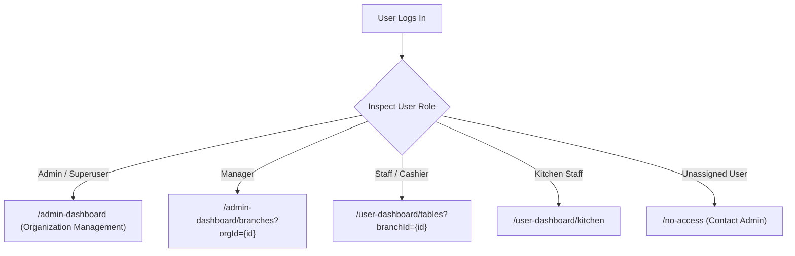
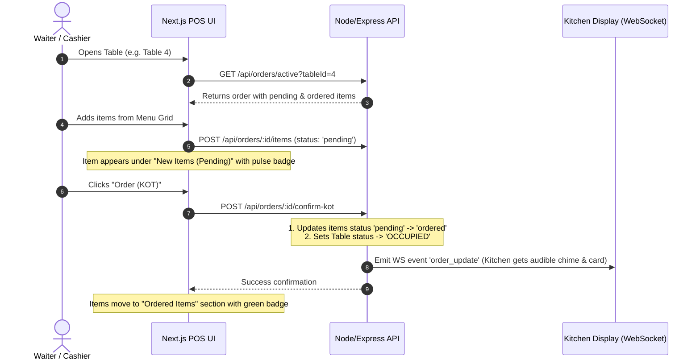
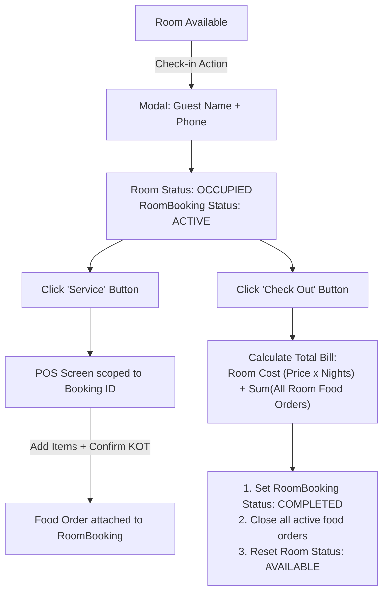

# Antigravity POS: Complete System Flow & Next.js Architecture Specification
> **From Django (`sample-petpooja`) to Next.js (`Pos-New-Frontend`) + Node/Express (`Pos-new-Server`)**

---

## 1. System Overview & Architecture Comparison

| Component | Django Implementation (`sample-petpooja`) | Next.js Target (`Pos-New-Frontend` + `Pos-new-Server`) |
| :--- | :--- | :--- |
| **Frontend Framework** | Django Templates + HTMX + Alpine.js | Next.js 16 (App Router) + React 19 + TypeScript |
| **Styling & Animations** | Tailwind CSS + Alpine Transitions | Tailwind CSS v4 + Framer Motion + React Icons |
| **Backend API** | Django Class-Based Views (CBVs) + Channels | Node.js + Express REST API |
| **Realtime Engine** | Django Channels (ASGI + Daphne + Redis) | Socket.io / Native WebSockets |
| **Database** | SQLite / PostgreSQL (Django ORM) | MongoDB (Mongoose ODM) |
| **Auth & Security** | Django Session / Cookie Auth + RBAC Mixins | JWT (JSON Web Tokens) with Role-Based Middleware |

---

## 2. Multi-Tenant Entity Hierarchy & Relational Schema

```text
Organization (Master Entity)
 └── Branch (Physical Outlets)
      ├── Area (Physical Zones: AC Hall, Garden, Terrace, Ground Floor)
      │    └── Table (Dine-in Tables: T1, T2, T3... Status: AVAILABLE / OCCUPIED)
      │
      ├── Room (Lodging/Hotel: R101, R102... Status: AVAILABLE / OCCUPIED / MAINTENANCE)
      │    └── RoomBooking (Active Guest Check-in records)
      │         └── Orders (Room Service food & beverage orders)
      │
      └── Category (Menu Groups: Starters, Mains, Desserts, Beverages)
           └── MenuItem (Food/Drink items with Price and Availability toggle)
```

### Relational Schema Definitions

#### 1. Organization & Branch
- **Organization**: `id`, `name`, `createdAt`
- **Branch**: `id`, `organizationId`, `name`, `address`, `phone`, `isActive`

#### 2. Areas & Tables
- **Area**: `id`, `branchId`, `name`, `description`
- **Table**: `id`, `number`, `areaId`, `availabilityStatus` (`AVAILABLE`, `OCCUPIED`)

#### 3. Hotel Rooms & Bookings
- **Room**: `id`, `branchId`, `number`, `roomType` (Deluxe, Suite, Standard), `pricePerNight`, `status` (`AVAILABLE`, `OCCUPIED`, `MAINTENANCE`)
- **RoomBooking**: `id`, `roomId`, `guestName`, `guestPhone`, `checkInAt`, `checkOutAt`, `status` (`ACTIVE`, `COMPLETED`, `CANCELLED`), `totalAmount`

#### 4. Menus & Categories
- **Category**: `id`, `name`
- **MenuItem**: `id`, `categoryId`, `name`, `price`, `isAvailable`

#### 5. Orders & Order Items
- **Order**:
  - `id`: Unique Order Number / ID
  - `branchId`: Associated outlet
  - `tableId`: (Optional) Associated dine-in table
  - `bookingId`: (Optional) Associated hotel room booking
  - `orderType`: `dine_in`, `takeaway`, `delivery`
  - `status`: `active`, `completed`, `cancelled`
  - `paymentMethod`: `cash`, `card`, `upi`, `cheque`
  - `subtotal`: Sum of all items ($\sum \text{price} \times \text{quantity}$)
  - `gstEnabled`: Boolean (Default: `true`)
  - `gstAmount`: Calculated 5% tax
  - `discount`: Flat discount amount (Default: `0`)
  - `serviceCharge`: Service fee (Default: `0`)
  - `total`: Final payable amount
  - `createdAt`: Order timestamp
  - `paidAt`: Completion timestamp
- **OrderItem**:
  - `id`: Unique Line Item ID
  - `orderId`: Foreign reference to parent Order
  - `menuItemId`: Reference to MenuItem (nullable for manual items)
  - `name`: Snapshot of item name
  - `price`: Price per unit at purchase time
  - `quantity`: Number of units (minimum: 1)
  - `status`: `pending` (Cart stage) vs `ordered` (Sent to kitchen/KOT)
  - `isManual`: Boolean (`true` if custom item created on POS)

---

## 3. Role-Based Access Control (RBAC) & Dynamic Landing

### Role Permissions Matrix

| Role | Scope | Accessible Routes & Capabilities |
| :--- | :--- | :--- |
| **Admin / Superuser** | Global (All Orgs & Branches) | Create/Edit/Delete Orgs, Branches, Users, Global Analytics, Full Access |
| **Manager** | Scoped to assigned Organization | Create/Edit Branches under Org, Rooms, Tables, Areas, Menus, Staff |
| **Staff / Cashier** | Scoped to assigned Branch | Live Table Grid, POS Order Taking, Room Service, Billing, Payments |
| **Kitchen Staff** | Scoped to assigned Branch | Kitchen Display System (KDS) View & "Mark as Ready" action |

### Dynamic Landing Redirect Flow

When a user authenticates:


---

## 4. End-to-End Business Workflows

### Workflow 1: Two-Phase POS Ordering Engine (The Core Flow)

In Petpooja and the Django POS, orders use a **two-phase commit** to distinguish items being considered in the cart from items fired to the kitchen.



#### Dual-State Action Button Logic:
- If `order.items` has ANY item where `status === 'pending'`:
  - Button Label: **`Order (KOT)`**
  - Button Color: **Orange / Amber** (`bg-premium`)
  - Action: Commits pending items to kitchen and prints/emits KOT.
- If ALL items in order have `status === 'ordered'`:
  - Button Label: **`Pay`**
  - Button Color: **Emerald Green** (`bg-emerald-600`)
  - Action: Opens the **Payment Modal** to complete checkout.

---

### Workflow 2: Custom Manual Items

Staff often need to add items that do not exist in the regular menu (e.g., custom mocktail, catering add-on, off-menu request).

1. Staff clicks **"+ Manual Item"** at the top of the menu screen.
2. A modal prompts for:
   - **Item Name** (e.g., "Special Eggless Chocolate Pastry")
   - **Price** (e.g., `350.00`)
3. Submitting sends `POST /api/orders/:id/manual-item` with:
   ```json
   {
     "name": "Special Eggless Chocolate Pastry",
     "price": 350.00,
     "quantity": 1,
     "isManual": true,
     "status": "pending"
   }
   ```
4. Displays in POS and on KDS with a distinct **`[MANUAL]`** tag.

---

### Workflow 3: Financial Tax & Discount Calculations

All billing calculations follow strict financial rounding:

$$\text{Subtotal} = \sum (\text{item.price} \times \text{item.quantity})$$

$$\text{GST Amount} = \begin{cases} \text{Subtotal} \times 0.05 & \text{if GST toggle is ON} \\ 0 & \text{if GST toggle is OFF} \end{cases}$$

$$\text{Payable Total} = \text{Subtotal} + \text{GST Amount} + \text{Service Charge} - \text{Discount}$$

#### UI Controls:
- **GST 5% Toggle**: Live switch. When toggled, instantly posts to `/api/orders/:id/toggle-gst` and updates the summary.
- **Discount Input**: Staff enters flat monetary discount (e.g., ₹100 promo or manager waiver).
- **Service Charge**: Configurable flat or percentage charge.
- **Bill Button**: Triggers a printable receipt popup / thermal printer format (`window.print()`).

---

### Workflow 4: Payment Processing & Table Release

1. Staff clicks **"Pay"**.
2. **Payment Modal** opens displaying:
   - Total amount due (e.g., `₹1,420.00`)
   - 4 Payment Method tiles:
     - **Cash**
     - **Card**
     - **UPI**
     - **Cheque**
3. On selecting a method:
   - Backend sets `order.status = 'completed'`
   - Sets `order.paymentMethod = method`
   - Sets `order.paidAt = new Date()`
   - Releases the table: `table.availabilityStatus = 'AVAILABLE'`
   - Emits WebSocket event `table_update` to update all connected devices.
   - Redirects staff back to the Live Table Grid with a success banner.

---

### Workflow 5: Kitchen Display System (KDS)

- **Interface**: High-contrast Dark Mode (`bg-slate-900`) designed for kitchen screens and tablets.
- **Filter**: Displays all orders where `order.status === 'active'` and containing items with `status === 'ordered'`.
- **Card Contents**:
  - Table number badge (`T3`, `T8`)
  - Order ID & elapsed time (`3 mins ago`, `14 mins ago`)
  - List of ordered items with quantities and manual tags.
- **Actions**:
  - **"Mark as Ready"**: Advances order to ready/served, removing it from active kitchen queue.
- **Live Sync**: Uses WebSocket connection to automatically prepend new KOT cards without page refresh.

---

### Workflow 6: Hotel & Lodging System (Rooms & Room Service)

As implemented in Django [`pos/views.py#L863-L935`](file:///e:/pos/sample-petpooja/pos/views.py#L863-L935):



#### Detailed Calculation Logic (from lines 894–910):
```python
# 1. Calculate duration and room cost
duration = (timezone.now() - booking.check_in_at).days or 1
room_cost = room.price_per_night * duration

# 2. Sum all food & beverage orders placed by the room
service_total = sum(order.total for order in booking.orders.all())

# 3. Final aggregated bill
booking.total_amount = room_cost + service_total

# 4. Atomic settlement
booking.check_out_at = timezone.now()
booking.status = 'completed'
booking.save()

# 5. Reset room availability
room.status = 'available'
room.save()

# 6. Close all active orders attached to this booking
booking.orders.filter(status='active').update(status='completed', paid_at=timezone.now())
```

---

### Workflow 7: Order History & Advanced Reporting

- **Path**: `/user-dashboard/order-history`
- **Filters**:
  - Status: `Completed Orders` vs `Active / Current Orders`
  - Payment Method: All, Cash, Card, UPI, Cheque
  - Date Range: Start Date & End Date pickers
  - Branch Selector: Filter by outlet
- **Pagination**: 10, 20, 50 rows per page
- **Detail View**: View full breakdown of items, taxes, discounts, and print duplicate tax invoice.

---

## 5. Next.js App Router Structure Blueprint

```text
src/app/
├── (auth)/
│   ├── login/page.tsx               # Login with JWT + Role Redirect
│   └── register/page.tsx            # Account registration
│
├── admin-dashboard/
│   ├── page.tsx                     # Enterprise Analytics & Outlets overview
│   ├── organizations/page.tsx       # Superuser: Organization CRUD
│   ├── branches/page.tsx            # Branch CRUD & switcher
│   ├── add-areas/page.tsx           # Physical Area creation
│   ├── add-tables/page.tsx          # Table bulk & single creation
│   ├── add-menus/page.tsx           # Menu Category & MenuItem CRUD
│   └── add-users/page.tsx           # User accounts & Role assignment
│
├── user-dashboard/
│   ├── page.tsx                     # Branch Daily Stats & Quick Actions
│   │
│   ├── tables/
│   │   └── page.tsx                 # Live Table Grid with Area Tabs & Status Badges
│   │
│   ├── pos/
│   │   └── [tableId]/page.tsx       # High-performance POS Two-Phase Ordering
│   │
│   ├── rooms/
│   │   ├── page.tsx                 # Room Grid with Available/Occupied/Maintenance
│   │   ├── history/page.tsx         # Completed room stay archives & revenue
│   │   └── service/[bookingId]/page.tsx # Room Service POS Ordering
│   │
│   ├── kitchen/
│   │   └── page.tsx                 # Dark-mode Real-time KDS Screen
│   │
│   ├── order-history/
│   │   └── page.tsx                 # Filterable order history & printable receipts
│   │
│   └── menus/
│       └── page.tsx                 # Menu availability quick-toggles
│
└── components/
    ├── Navbar.tsx                   # Top navigation with branch switcher & user profile
    ├── ChooseBranch.tsx             # Modal / dropdown to switch active branch context
    ├── pos/
    │   ├── MenuGrid.tsx             # Menu catalog with live search & category pills
    │   ├── OrderCart.tsx            # Split cart: Pending Items vs Ordered Items
    │   ├── ManualItemModal.tsx      # Modal for custom name + price entry
    │   ├── PaymentModal.tsx         # Payment methods modal (Cash, Card, UPI, Cheque)
    │   └── ReceiptPrint.tsx         # Printable thermal/A4 tax invoice template
    └── rooms/
        ├── CheckInModal.tsx         # Guest name & phone check-in modal
        └── CheckOutModal.tsx        # Stay + food order calculation breakdown modal
```

---

## 6. Complete REST & WebSocket API Specification

### 1. Authentication & Scoping
- `POST /api/auth/login`
  - Body: `{ email, password }`
  - Response: `{ token, user: { id, name, role, organizationId, branchId } }`
- `GET /api/auth/me`
  - Returns current user context and permissions.

### 2. Branches, Areas & Tables
- `GET /api/branches?orgId={id}`: List all branches for organization.
- `POST /api/branches`: Create new branch.
- `GET /api/areas?branchId={id}`: List areas for active branch.
- `POST /api/areas`: Create area.
- `GET /api/tables?branchId={id}&areaId={id}`: Get tables with availability status.
- `POST /api/tables`: Create table(s).

### 3. POS Orders & Line Items
- `GET /api/orders/active?tableId={id}`: Get or auto-initialize active order for a table.
- `POST /api/orders/:orderId/items`:
  - Body: `{ menuItemId, quantity }` (Adds item with `status: 'pending'`).
- `POST /api/orders/:orderId/manual-item`:
  - Body: `{ name, price, quantity }` (Adds custom non-catalog item with `status: 'pending'`).
- `PATCH /api/orders/:orderId/items/:itemId`:
  - Body: `{ action: 'increase' | 'decrease' }`
- `DELETE /api/orders/:orderId/items/:itemId`: Remove pending item.
- `POST /api/orders/:orderId/confirm-kot`:
  - Atomically moves all pending items to `status: 'ordered'`, sets table to `OCCUPIED`, and broadcasts KDS update.
- `POST /api/orders/:orderId/toggle-gst`:
  - Body: `{ gstEnabled: boolean }`
- `POST /api/orders/:orderId/discount`:
  - Body: `{ discountAmount: number }`
- `POST /api/orders/:orderId/checkout`:
  - Body: `{ paymentMethod: 'cash' | 'card' | 'upi' | 'cheque' }`
  - Sets order `status: 'completed'`, releases table to `AVAILABLE`, logs `paidAt`.

### 4. Kitchen Display System (KDS)
- `GET /api/kitchen/orders?branchId={id}`: Get all active orders with confirmed items.
- `PATCH /api/kitchen/orders/:orderId/status`: Update status (`PREPARING` $\rightarrow$ `READY` $\rightarrow$ `SERVED`).

### 5. Hotel Rooms & Bookings
- `GET /api/rooms?branchId={id}`: Get rooms with active booking details.
- `POST /api/rooms`: Create new room (`number`, `roomType`, `pricePerNight`).
- `POST /api/rooms/:roomId/check-in`:
  - Body: `{ guestName, guestPhone }`
  - Sets room to `OCCUPIED`, creates active `RoomBooking`.
- `GET /api/bookings/:bookingId/active-order`: Get or initialize room service order.
- `POST /api/bookings/:bookingId/checkout`:
  - Calculates $(\text{room\_price} \times \text{days}) + \sum(\text{room food orders})$.
  - Closes booking, closes food orders, and resets room to `AVAILABLE`.
- `GET /api/rooms/history?branchId={id}`: Past completed bookings with bill breakdown.

### 6. Real-Time WebSocket Events
- **Client to Server**:
  - `join_branch({ branchId })`
- **Server to Client**:
  - `table_updated({ tableId, status: 'AVAILABLE' | 'OCCUPIED' })`
  - `kot_received({ orderId, tableNumber, items, createdAt })`
  - `order_updated({ orderId, status, items })`

---

## 7. Migration Checklist & Parity Roadmap

- [x] **Architecture Analyzed**: Full Django data flow, views, and templates mapped.
- [ ] **Two-Phase Cart Implementation**: Update Next.js POS cart to render separate "Pending (New)" and "Ordered (KOT)" item lists.
- [ ] **Dynamic POS Button**: Switch button between `Order (KOT)` (orange) and `Pay` (green) based on pending items existence.
- [ ] **Manual Item Modal**: Build popup component for custom item entry on the POS page.
- [ ] **GST Toggle & Discount Input**: Implement live 5% GST switch and discount deductions in billing summary.
- [ ] **Payment Modal**: Add modal with Cash, Card, UPI, and Cheque payment choices.
- [ ] **Hotel & Room Management**: Create `/rooms` page with Check-In, Check-Out calculation, and Room Service POS route.
- [ ] **Realtime Push Notifications**: Connect Socket.io to trigger instant Table Grid and KDS updates.
